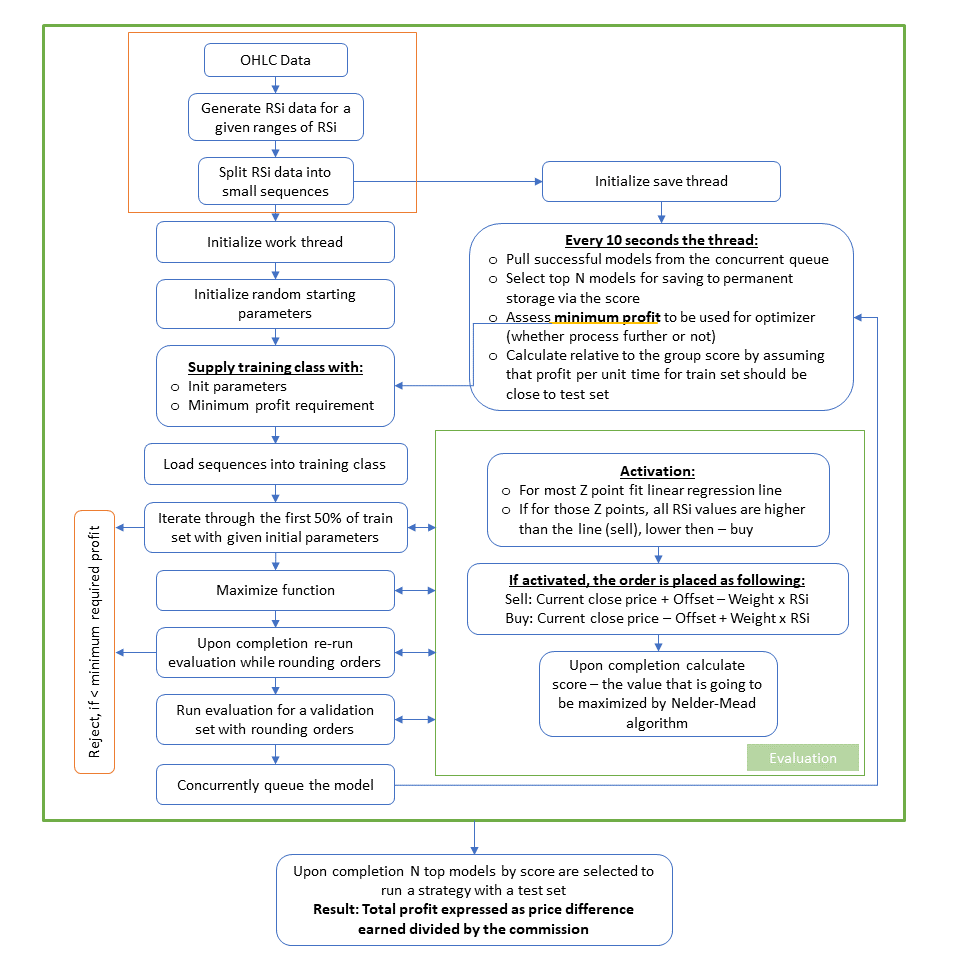

## Simple RSi Trader

### Hypothesis

A simple approach for a limit order inter-period trader for a derivative market. 
The idea is to place a limit order at the start of the period, specifying stop loss and take profit. Once period is over -- close the order whether profit or loss. 
However if a big change of the price happen -- take a fixed profit.

For `buy` operation a line is placed with contant being less or equal 50, and a negative slope. 
For `sell` operation a contant should be more or equal 50, and a positive slope.
The expectations are that all the RSi points should be either above (for sell) or below the line (for buy). The maximum cut off should not exceed 90 for sell and 10 for buy operations respectively.

### Flow chart

### Configuration & Optimization

Constant configurations are specified in SignalModel class per financial instrument individually. 

Non-constant configurations are specified in ParametersModel class. Some of those parameters will be optimized using Nelder-Mead algorithm.

The program is designed for parallel execution specified via `_degreeOfParallelism` variable, by default of logical processors will be utilized.